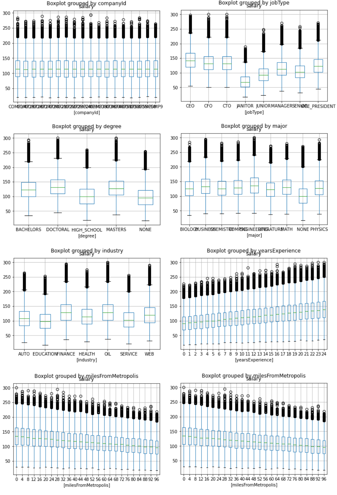
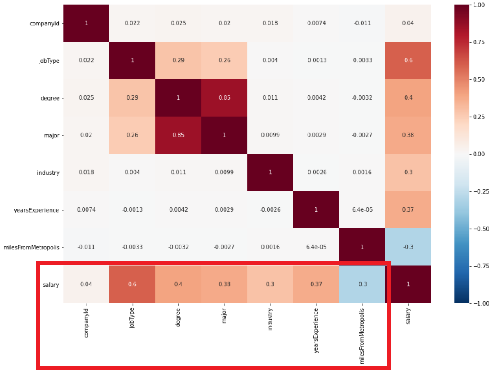
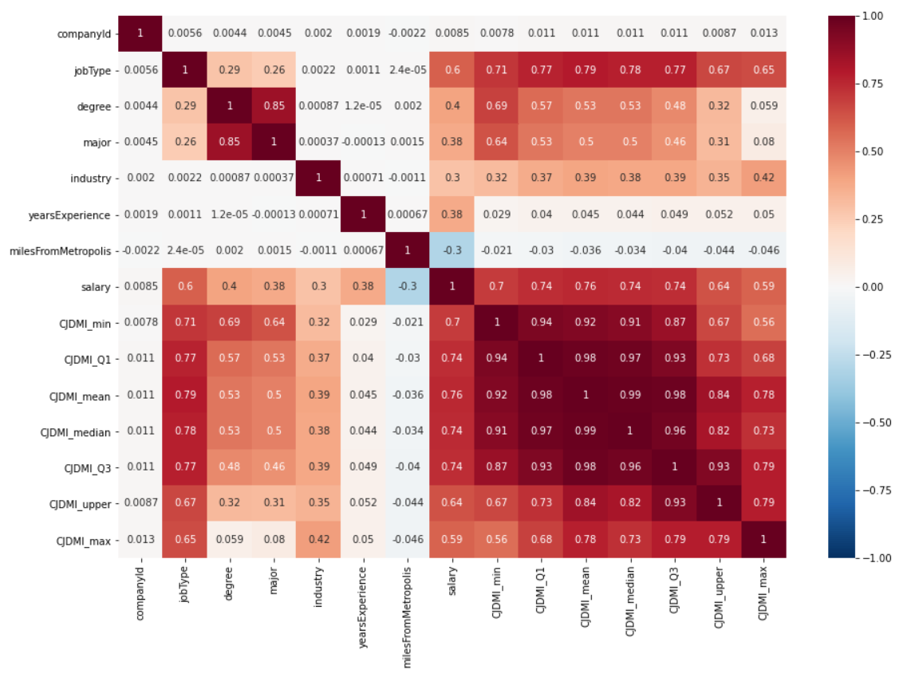

# Salary Prediction Project
## Define problem
In job posting websites like Glassdoor, LinkedIn, and Indeed, each post lists its required skills, education, qualification, experience, ..., and of course, salary. 
* For applicants, instead of accepting the salary employer proposed, having an estimator predicting the salary based on job requirements or skills acquired gives confidence of their worth for further negotiation. 
* For employer, an salary estimator suggests a market standard so employers can propose a reasonable salary to attract more applicates. 

The goal of this project is to create a model that estimates a salary given jobs with various of requirements.

## Approach
1. Data loading
    * train_features.csv file contains training set features
    * train_salaries.csv file contains training set target, salary
    * test_features.csv file contains testing set features

2. Data scrubbing
    * Remove incomplete instances
    * Remove duplicated instances
    * Remove invalid instnaces
        * Salary <= 0
        * yearsExperience < 0
        * milesFromMetropolis < 0

3. Exploratory Data Analysis (EDA)

Explore data, find distribution of each features and categories, and visualize data to find embedded pattern(s).

3. Encoding

Convert categories to distinguishable numerical values using category average salary

4. Feature engineering

Not all features are independent, thus adding interaction features provides more information on dependencies between features. Generate new features based on IQR rule, including group min, first quantile, median, mean, third quantile, upper bound for outliers, and max.

5. Modeling

For mechine learning approach: 

Use default 5-fold cross validate and MSE to select best model.
  1. Establish baseline: use average salary for each industry as baseline model and measure MSE    
  2. Try vanilla models (use default hyperparameter values) and select couple good models. In this case I selected:
      * LinearRegression - MSE = 351.652
      * RandomForestRegressor - MSE = 337.152
      * GradientBoostingRegressor - MSE = 328.327        
      * ExtraTreeRegressor - MSE = 343.122        
  3. Try training with standardized data: no obvious improvement
      * Scaled LinearRegression - MSE = 351.652
      * Scaled RandomForestRegressor - MSE = 337.228
      * Scaled GradientBoostingRegressor - MSE = 328.327
      * Scaled ExtraTreeRegressor - MSE = 343.046        
  4. Tune model: tune best 2 models
      * RandomForestRegressor - best MSE: 313.741
      * GradientBoostingRegressor - best MSE = 306.792

For neural network approach:

Use simple Dense layers and tune network topology. The best result is MSE = 313

6. Deploying

Use best model, GradientBoostingRegressor(n_estimators=100, loss='ls', max_depth=8), to predict test set.
